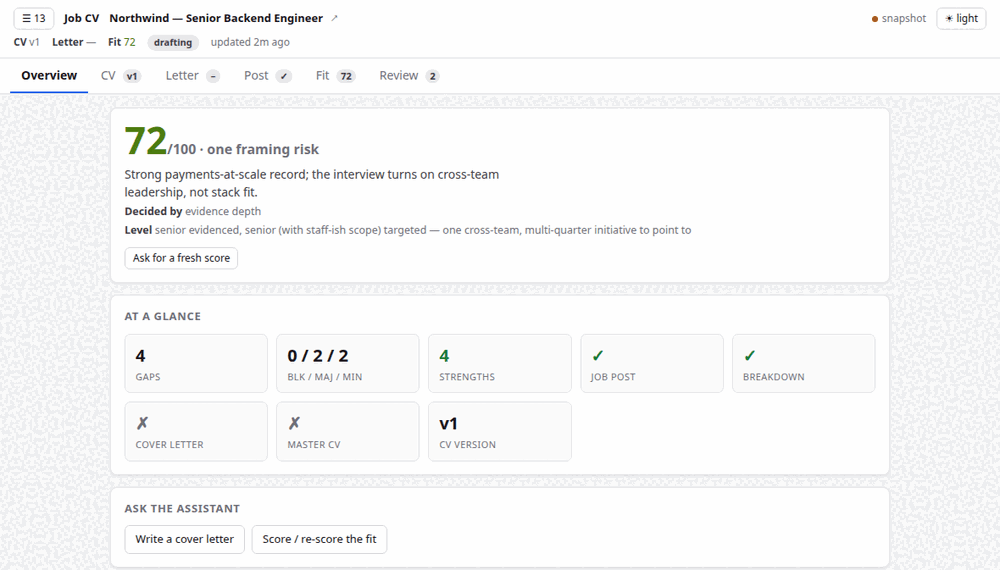
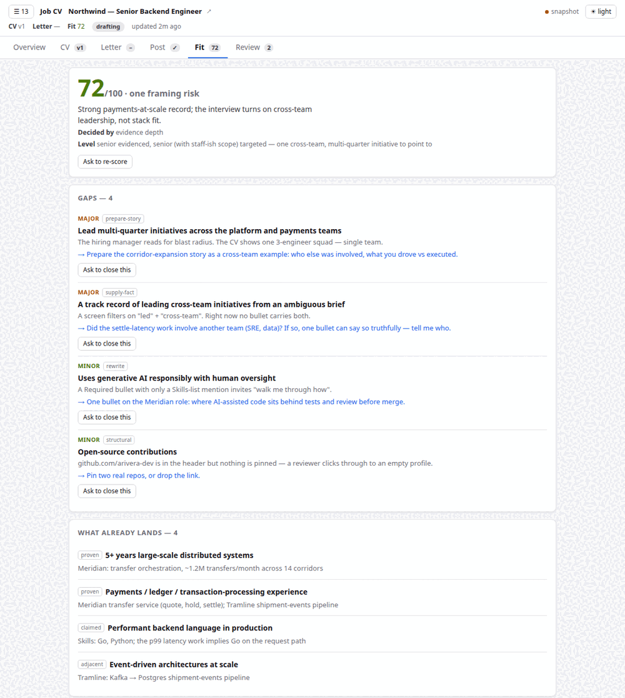
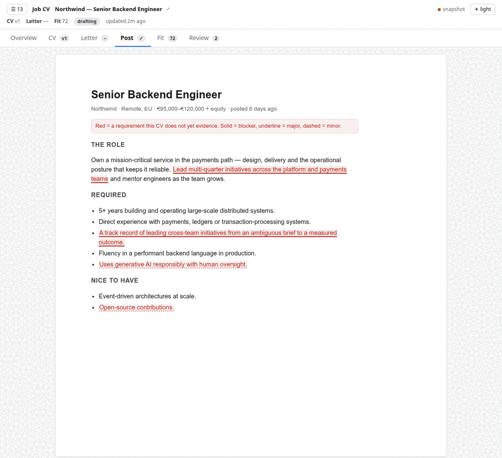
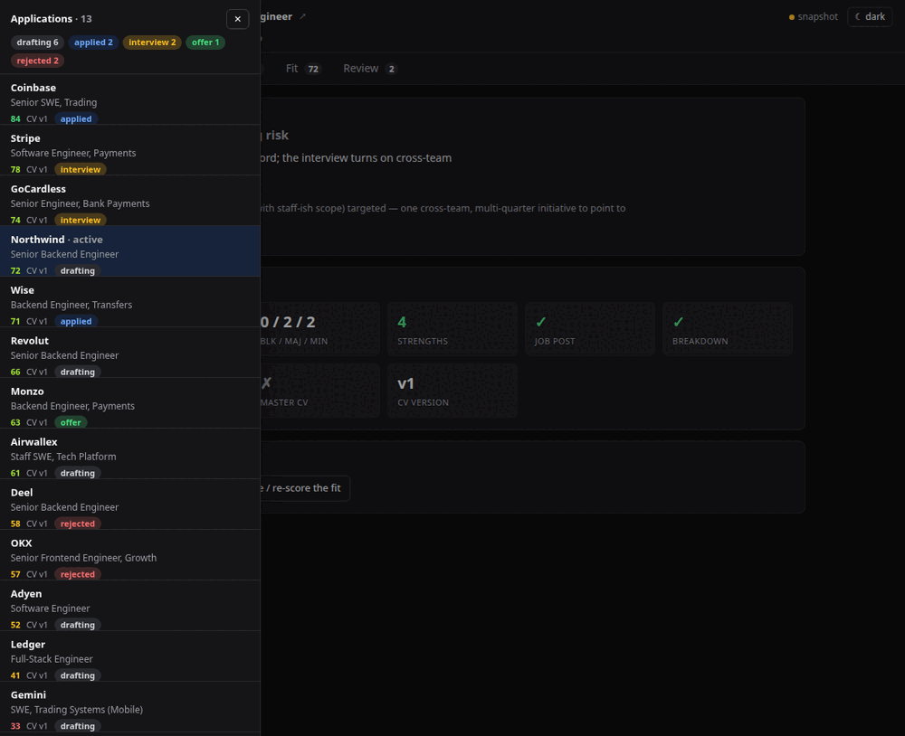

# dsh-job-cv

One workflow — **tailoring your CV against a specific job post** — behind two
front ends:

- a [DeepSeek Harness](https://github.com/deepseek-ai/deepseek-harness) (DSH)
  **web-GUI plugin** (_Job mode_: the chat narrows to a sidebar and the main
  area becomes a live A4 CV preview the agent maintains); and
- a standalone **[Model Context Protocol](https://modelcontextprotocol.io)
  server** for any MCP client — **you do not need DSH** — with its own live
  preview page you keep open beside the conversation.

Both read and write the same state, so an application you start in one shows up
in the other. If you use Claude Code, Claude Desktop, Cline or any other MCP
client, jump to [**Also an MCP server**](#also-an-mcp-server).

<p align="center">
  
  
</p>
<p align="center">
  
  
</p>
<p align="center"><sub>The MCP shell's preview: an Overview dashboard, the Fit panel, the marked-up Post, and the applications drawer (shown dark). Light / dark / system toggle. The DSH plugin renders the same panels inside the harness.</sub></p>

## Features

- **Job agent preset** — seeds a `job` preset into `$DSH_HOME/.agent-presets/job`
  (persona: **Close**, a candidate-side career strategist who works for the
  candidate and never the employer). The mode appears in the new-session chip
  and the Settings roster without further configuration; a locally edited seed
  is never clobbered.
- **Live preview pane** — the document renders in a sandboxed iframe while the
  chat stays reachable in a sidebar. Saves are **pushed** over a server-sent
  stream (a 2.5 s poll runs underneath as the fallback), so every agent save
  appears within seconds and is announced ("v4 · just updated"). A host that
  stops answering — or a 403 from the trust gate on a LAN address — is
  reported, never silently frozen.
- **Split or overlay, decided on real room** — enough center column and the
  preview sits beside a squeezed chat with a draggable divider (double-click
  resets); too little room and it takes the window, `Esc` returns. The choice
  re-decides live as panels open and close, and persists per session.
- **True A4 paper** — `.page` divisions render as separate sheets on a desk,
  laid out at the 210 mm the PDF prints at and scaled as one when the pane is
  narrow, so preview and print cannot disagree. Blank sheets are named and
  dropped in every medium; a sheet running past 297 mm turns red with a strip
  saying by how much — and a **Make it fit** button that asks the agent to
  move the overflow without shrinking the type or cutting evidence.
- **Cover letter** — a second document, not a section: its own version line,
  its own history, its own route (`POST /jobcv/letter`). One request writes it
  on a skeleton sheet; once it lands the toolbar becomes a CV / Letter toggle.
- **The job post, in the preview** — the posting rendered as a styled A4 page
  with every requirement the CV does not evidence wrapped in red
  (`blocker` solid, `major` underlined, `minor` dashed), each explained one tap
  away on a phone. The raw text stays pasteable and re-fetchable; a practical
  facts strip carries location, salary, applicant counts and deadlines with
  sources named.
- **Fit score and gaps** — "68% fit" lives in the toolbar and dock, computed by
  the agent (never keyword overlap in the browser). The panel lists gaps by
  severity with the move that closes each — one gap or the whole set goes back
  to the agent as one message — and marks itself stale the moment the document
  moves underneath it.
- **History as a timeline** — versions labelled by the note their author wrote,
  newest first. Clicking shows a version without changing anything; restoring
  is a deliberate second step that saves forward, so nothing is ever lost by
  going back. The cover letter has its own timeline on the same terms.
- **Proposals before changes** — wording edits arrive as a reviewable set: what
  the text says now, why, alternatives, a box for your own words, skip. One
  **Apply** sends every decision, and the contract binds the agent to them
  verbatim.
- **Comment on a part** — the document becomes a pick surface: click or drag a
  range with a mouse, tap with a finger. Preset chips fill in the common asks,
  notes queue up, and the batch sends as ONE chat message naming the document,
  section, path and quoted text for every part.
- **Edit it yourself** — a typo should not cost an agent turn: Edit makes the
  page editable in place, saves through the same version line as everything
  else ("Edited by hand", or your note), freezes the frame against mid-sentence
  agent saves, and refuses to drop unsaved words on a tab switch.
- **Export PDF** — the browser print dialog, Save as PDF, A4; the download is
  named `Firstname_Lastname_CV_Job_Company.pdf` (and `…Cover_Letter…` for the
  letter) from the document's own header plus the candidacy.
- **Candidacy workspace** — one folder per application at
  `<root>/<company>/<job-id>/`, upserted by the agent and mirrored on every
  save; the dock lists its files with hover (or tap) previews and `Open ↗`.
- **Application tracker** — an **Applications** panel above the composer lists
  every application with the latest CV, cover letter and stored post of its
  candidacy, each carrying a status tag the user maintains — `drafting`,
  `applied`, `interview`, `offer`, `rejected` — with the applied date stamped
  automatically, a one-line note ("phone screen Fri 14:00") and the path the
  tag took. Past a handful of rows it becomes a workbench: search across every
  field the listing carries (with `/`), three views over the same rows
  (list cards / a stage-by-stage board / a dense table), filters built from
  what each job spec has (stage chips with counts, artifacts, company, fit
  band, recency) and a sort on every axis. The arrangement persists per
  session; the typed query does not. The tag mirrors into the candidacy folder
  as `status.json`, so two sessions on one application — or a hand edit
  outside the harness — agree on where things stand; the newer write wins. A
  row opened from another session offers **Resume here**, which hands the
  agent the exact folder to adopt.
- **Master CV, and deltas against it** — one document is the source of truth
  (`POST /jobcv/master`, its own version line like the cover letter's,
  mirrored to `<root>/master/cv/latest.html`): every application tailors it,
  and its onboarding row sits pinned above every past application's byproduct.
  `GET /jobcv/delta` computes what a tailored CV changed against it — a
  normalized text-block diff built host-side, so "what did tailoring move"
  costs one small read however many applications pile up, never a re-read of
  every full CV. The preview toolbar grows a **vs master** panel rendering
  that diff (green what this candidacy gained, red what it left out), stale-
  marked when the document moves underneath it; the contract tells the agent
  to start from the master when no CV is named, and to propose folding
  generally-true improvements back before saving them there.
- **Jobs list onboarding, and switching** — the start form has a second door:
  **From a list** points at a markdown file of postings (one job per line,
  `- Title — https://…`; a `## Company` heading names the employer below it),
  the host parses it once (`POST /jobcv/joblist`), and its lines become the
  pick surface — one chosen line starts exactly the same tailoring flow as a
  pasted link. The **Jobs** panel in the dock keeps that list all session:
  clicking another line switches which posting this session works on. An
  unstarted line starts fresh (CV pre-filled from the list); a started one
  resumes with its whole history — versions, letter, stored post, fit score
  and status tag — because the outgoing candidacy archives itself into the
  session's store and the incoming one takes over the preview. Nothing is
  ever overwritten by a switch.
- **Multi-device out of the box** — phone, tablet and desktop are first-class:
  swipe between tabs inside the iframe, tap-to-pick comments, tap-to-open gap
  callouts, 34 px touch targets, 16 px inputs (no iOS focus zoom), a wide
  invisible divider handle, viewport-clamped popovers, and contained scroll so
  the page behind the pane never moves.

## Install

> Requires Node.js 22.19+ and pnpm (`dsh plugin` installs through pnpm under
> the hood).

```sh
# local checkout (development)
dsh plugin --profile web add <path-to-this-checkout>

# from a git remote (after publishing)
dsh plugin --profile web add github:<you>/dsh-job-cv
```

Then **restart `dsh web`** and refresh the browser page. The install adds
`dsh-job-cv` to the profile's `dsh.profile.bundles`; if it is not added
automatically, append `"dsh-job-cv"` to that array in
`$DSH_HOME/profiles/web/package.json` and restart `dsh web`.

Both halves mount on their next boot: the host routes and the `job` preset
seed at startup, the client bundle on page refresh.

## Also an MCP server

**No DSH required.** The whole workflow runs as a
[Model Context Protocol](https://modelcontextprotocol.io) server for any MCP
client — Claude Code, Claude Desktop, Cline, and anything else that speaks MCP.
It serves its own live preview page (the four panels shown at the top of this
README: CV · Fit · Post · Review), so you get the same beside-the-chat view the
DSH plugin gives without the harness. If you also run DSH, nothing changes —
both front ends read and write the same state under `$DSH_HOME/dsh-job-cv`, so
an application you start in one appears in the other.

### Add it

```sh
# Claude Code, from a checkout
claude mcp add job-cv -- node /abs/path/to/dsh-job-cv/bin/dsh-job-cv-mcp.js \
  --root ~/where/your/job-applications/live

# once published to npm
claude mcp add job-cv -- npx -y dsh-job-cv-mcp --root ~/job-applications
```

Other clients: register `node bin/dsh-job-cv-mcp.js` (or `npx -y dsh-job-cv-mcp`)
as a **stdio** MCP server. Only Node 22.19+ is needed — the package has zero
runtime dependencies.

### Use it

Ask your assistant to tailor your CV against a posting. It calls `jobcv_context`
first (which returns a `preview:` URL — **open that in a browser** and keep it
beside the chat; it also prints on the server's stderr on start), opens the
candidacy, fetches and stores the post, scores the fit, and saves the tailored
CV. The preview updates live.

**The preview is interactive.** An **Overview** dashboard leads with the fit
score, an at-a-glance metric grid and one-click asks. Buttons — _write a cover
letter_, _re-score_, _fetch the post_, _close this gap_, and **Mark a line** on
the CV to say what's wrong with it — don't need a composer: they drop a
structured request into an inbox that rides `jobcv_context.pendingRequests`, so
your assistant picks it up on its next turn. What you can do directly, the UI
does directly: switch the active application, set a status, restore a version,
toggle light / dark. Your applications live in a drawer behind a discreet
button, a virtualised list that stays smooth at any length.

URL params: `?tab=overview` (or `cv`, `letter`, `post`, `fit`, `review`) deep-links
a panel; `?theme=dark`; `?drawer=1` opens the applications list; `?live=0` for a
static snapshot.

`--root` (or `$DSH_JOB_CV_ROOT`) sets where the per-application folders are
written — one folder per job, with the CV, cover letter and post inside, that
you can open and keep outside any tool. Defaults to
`$DSH_HOME/dsh-job-cv/applications`. The session id is the **server's** — minted
once, remembered in `$DSH_HOME/dsh-job-cv/mcp-session.json`, injected into every
call — so there is nothing to copy and nothing to get wrong. `--fresh` starts a
new one.

### The surface

17 typed tools, each a thin wrapper over the same `/jobcv/*` operations the
plugin uses: `jobcv_context` · `jobcv_open` · `jobcv_get` · `jobcv_save_cv` ·
`jobcv_save_letter` · `jobcv_save_master` · `jobcv_save_profile` ·
`jobcv_set_post` · `jobcv_set_brief` · `jobcv_score` · `jobcv_propose` ·
`jobcv_switch` · `jobcv_set_status` · `jobcv_restore` · `jobcv_resolve_requests` ·
`jobcv_load_joblist`. `jobcv_context` carries `pendingRequests` (things clicked
in the preview) — act on them, then `jobcv_resolve_requests` their ids.
Resources: `jobcv://skill` (the full contract), `jobcv://profile` (your standing
facts), `jobcv://context`.

Reading the post is the client's job in this shell — there is no fetch tool
inside the server. Your assistant fetches the posting with its own web tool,
then calls `jobcv_set_post` with the readable text.

One rough edge: a `jobcv_propose` decision has no chat back-channel here, so the
preview's Review tab shows a copy-paste message ("Apply proposal p3: c1 → …") to
hand back to the assistant.

## Usage

1. Start a new session in **Job mode** (preset chip / Settings roster).
2. A fresh session shows an **onboarding start form** in the preview. Two
   ways in: paste the public job post link (**Single job**), or switch the
   form to **From a list** and point at a markdown file of postings — pick a
   line and that job starts. Either way, point at your current CV next:
   the CV field first lists your **master CV pinned at the top** (when one
   exists), then the **latest CV of every past application**
   (`GET /jobcv/cvs`, newest first) — pick one and its path fills in; or
   ignore the list and type a path, or drop a file (PDF/DOCX) onto the form,
   which stages it through `POST /jobcv/intake`. A company name is optional
   (a list line fills it in for you) and steers the workspace folder.
3. **Start** hands the link + CV path to the chat. The agent fetches the
   post, upserts a candidacy workspace (`POST /jobcv/workspace`,
   `<root>/<company>/<job-id>/`), tailors the CV, and saves it through
   `POST /jobcv/doc` — the preview updates within seconds. If the composer
   is unreachable but a company name was given, the form opens the
   workspace itself and shows the message to copy. The save must carry
   `Content-Type: application/json`; the `/jobcv/skill` contract spells
   the call out, because the trust gate rejects the content type `curl -d`
   would otherwise pick.
4. The dock shows the workspace folder (labeled with company — job title
   when known) and the files the agent has saved into it, refreshed with
   the same poll as the preview. Hovering a file chip previews its content
   (HTML renders sandboxed, text and images render inline); `Open ↗` inside
   the preview opens the full file in a new tab.
5. Iterate by chatting ("make the summary sharper", "cut to one page").
   **History** on the preview toolbar lists every saved version, newest
   first, and restores any of them with one click — restoring is itself a
   save, so the old current version stays in history.
6. **Export PDF** on the preview toolbar. The download is named
   `Firstname_Lastname_CV_Job_Company.pdf` (and
   `Firstname_Lastname_Cover_Letter_Job_Company.pdf` for the letter) — the
   name comes from the document's own header, the job title and company
   from the candidacy, and whatever is not known yet is left out.
7. **Track it** from the **Applications** button in the dock: every past and
   current application, newest activity first, each with its status tag.
   When you tell the agent where you stand ("I applied yesterday", "they
   rejected me"), it records the tag for you through `POST /jobcv/status` —
   the contract forbids it from guessing one on its own. When you want to
   work a different posting instead, the **Jobs** button switches this
   session to another line of your list — or loads one if you started with
   a single link.

## How it works

The `/jobcv/*` route surface, the self-contained-HTML document rules, the
A4 pagination and overflow behaviour, and what every preview panel does are
documented in **[docs/how-it-works.md](docs/how-it-works.md)**. The shape of
the codebase — the shared core and the two shells — is in
**[docs/ARCHITECTURE.md](docs/ARCHITECTURE.md)**.

## Development

- Edit the browser half in `lib/client/*.js`, then `npm run build:client`
  (`lib/client.js` is generated and stays committed).
- `npm test` verifies the built bundle matches its fragments and runs the
  host-half tests.

### The candidacy folder

One folder per application, upserted at `<root>/<company>/<job-id>/`. The
root is the **session's own working directory** — an application is work you
keep, open, diff and back up, so it belongs in the project you started the
session in rather than buried in `$DSH_HOME` beside the plugin's state.
Resolution order:

1. `$DSH_JOB_CV_ROOT` — an explicit choice always wins;
2. the session's `cwd`;
3. `$DSH_HOME/dsh-job-cv/applications` — only when the session has no cwd.

```
acme-corp/3812345678/
  README.md         what this application is, and the job link
  application.json  the recorded identity — which posting this folder is FOR
  status.json       the pipeline tag, mirrored from the session record
  cv/               v1.html, v2.html … plus latest.html
  source/           the CV as supplied — never edited
  notes/            the fetched job post, research, cover letter drafts
```

Beside the company folders sits the **master**'s mirror,
`master/cv/latest.html` — the source of truth every tailored CV derives
from, written on read as well as on save so a new project root meets it
with a real file. The master's own record (its JSON version line and
history) lives under `$DSH_HOME/dsh-job-cv/master.json`; like every mirror,
the folder copy is a convenience and the record is authoritative.

The host derives both folder names (`slugify` for the company; the job's own
id from the URL, else a slug of the last path segment, else a digest of the
link). That is what makes the upsert an upsert: a second session about the
same job lands in the same folder and gets `created:false`, the agent's cue
to say it is resuming rather than starting over.

**The folder is matched by posting, not by company spelling or folder
name.** Each folder records its canonical URL in `application.json`; before
creating `<slug(company)>/<job>`, the upsert scans the applications root for
ANY folder whose recorded identity claims this posting and adopts it — so
"Acme" today and "Acme Corp" next week (or a re-paste with different `?trk=`
dust, or `http` vs `https`) stay ONE candidacy instead of forking twins that
would overwrite each other's `cv/`. A folder made by an older build speaks
through its creation breadcrumb instead: the `Job post:` line every README
has carried since the first release identifies it just as well. When no URL
was ever recorded anywhere but exactly one folder is named after a
board-minted id (four-plus digits or a uuid — ids no two postings share),
that folder is adopted too. Two limits keep this honest: text slugs never
merge across companies without evidence (two firms can honestly share
`senior-engineer`), and a preferred path already owned by a DIFFERENT
posting never mixes them — the newcomer gets a stable sibling named
`<job>-<hash8>` derived from its own link.

Every save is mirrored into `cv/` under a **best-effort folder lock**, so two
sessions holding the same application active serialize their writes instead
of racing per file name. The lock is deliberately not load-bearing: after a
short wait — or when it looks abandoned (a killed process) — the write
proceeds unlocked, because mirroring never fails a save: the session file is
the source of truth, and a folder that has been moved or made read-only only
logs a warning. A CV dropped into the start form lands in `source/` once the
folder exists, and in per-session staging before that (browsers withhold the
real path of a dropped file, so its bytes are uploaded).

- Documents persist per session under `$DSH_HOME/dsh-job-cv/sessions/`
  with the last 10 versions kept in history — the groundwork for a fuller
  job workspace (rollback, multiple documents per job application). The
  master CV's own record lives beside them as `master.json`, on the same
  terms: last 10 versions, atomic writes, and a file that cannot be parsed
  raises rather than reading as empty.
  Saves are serialized per session and written temp-file-then-rename, and
  a document file that cannot be parsed raises instead of quietly reading
  as a new session (which would let the next save overwrite it).

## License

[MIT](./LICENSE)
